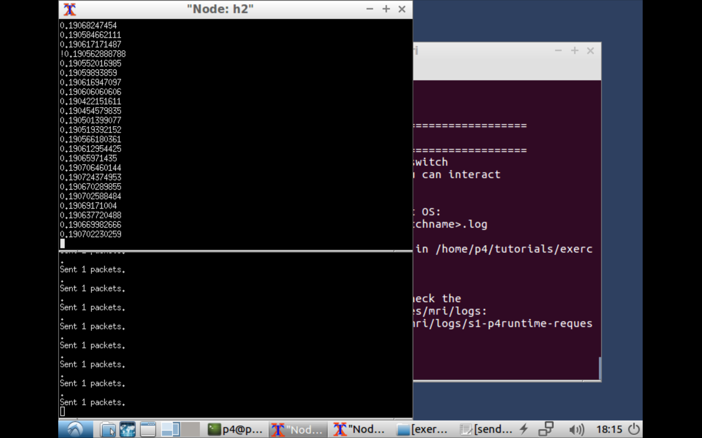

Demo Video: https://b23.tv/JcBqoY

# FindINT
A packet loss detection and location solution based on AM-PM and INT, suitable for Mininet environment, written in P4 language.

FindINT supports two encoding methods of Loss_Bit:

**（1）SAM, Single-Bit Alternate Marking**

For example, when the alternate period is 6, the INT Source Node marks the arriving telemetry data packets according to the rule of "0 0 0 1 1 1 0 0 0 1 1 1 ...".

**（2）MCM, multi-bit cycle mark**

For example, when the length of Loss_Bit is 2, INT Source Node marks the arriving telemetry data packets according to the rule of "00 01 10 11 00 01 10 11 ...".

By marking point by point, FindINT supports packet loss location.

How to use FindINT:

1. Install P4-Tutorial mirror, recommend https://github.com/p4lang/tutorials/

2. Find the /usr/local/share/p4c/p4include/v1model.p4 file and find:
     
     void read(out T result, in bit<32> index);

Add a line before this line:     

     register(bit<32> size, T initial_value);

The effect is as follows:

     *              ignored by the caller.
     */
    register(bit<32> size, T initial_value);
    void read(out T result, in bit<32> index);
    /***
     * write() writes the state of the register array at the specified
     * index, with the value provided by the value parameter.
     
3. Unzip FindINT into the exercises folder and enter FindINT.
4. Execute Make in the terminal.
5. Test
     h1 ping h2
And successfully pinged.

6. Open the terminal
    
    xterm h1 h2
    
7. Execute in H2
    
    ./receive.py
    
8. Execute in H1

    ./send.py 10.0.2.2 "123" 100000
     
100000 is the number of INT packets.

9. The packet loss rate measurement result is observed in H2.

# 中文简介

FindINT支持两种丢包位（Loss_Bit）编码方式：
**（1）SAM，单Bit交替标记**
例如，交替周期为6时，INT Source Node 按照“0 0 0 1 1 1 0 0 0 1 1 1 ...”的规律标记到达的遥测数据包。
**（2）MCM，多Bit循环标记**
例如，Loss_Bit长度为2时，INT Source Node 按照“00 01 10 11 00 01 10 11 ...”的规律标记到达的遥测数据包。
通过逐点标记，FindINT支持丢包定位。

使用方式：

1.安装P4-Tutorial镜像，推荐https://github.com/p4lang/tutorials/

2.找到/usr/local/share/p4c/p4include/v1model.p4文件，找到：
     
     void read(out T result, in bit<32> index);

在该行前面添加一行：     
     
     register(bit<32> size, T initial_value);

效果如下：

     *              ignored by the caller.
     */
    register(bit<32> size, T initial_value);
    void read(out T result, in bit<32> index);
    /***
     * write() writes the state of the register array at the specified
     * index, with the value provided by the value parameter.

3.将FindINT解压到exercises文件夹中，并进入FindINT。

4.在终端中执行Make。

5.测试 

     h1 ping h2

并成功ping通。

6.打开终端

     xterm h1 h2

7.在H2中执行

     ./receive.py

8.在H1中执行

     ./send.py 10.0.2.2 "123" 100000
     
其中100000是INT数据包数量。

9.在H2中观察到丢包率测量结果。
